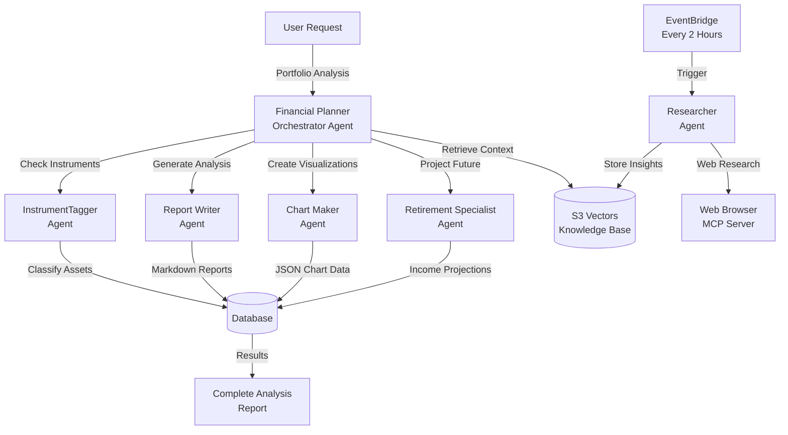
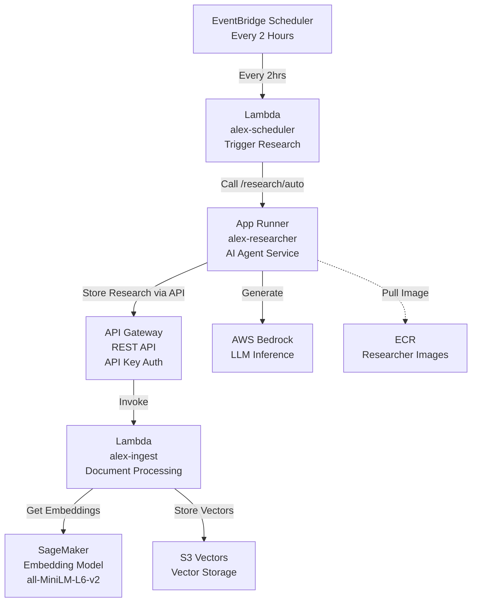
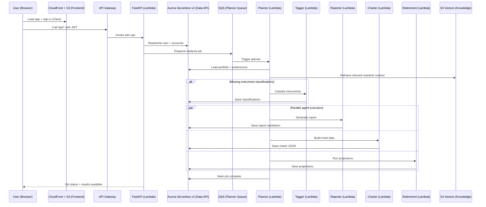

# Alex — Agentic Learning Equities eXplainer

Multi-agent, enterprise-grade SaaS financial planning platform built for the **AI in Production** course.


## What this project does

Alex helps users understand and improve their portfolios via a team of collaborating AI agents:

- A **Planner** orchestrates the workflow.
- Specialized agents generate **instrument classifications**, **written portfolio analysis**, **charts**, and **retirement projections**.
- An autonomous **Researcher** continuously gathers market insights and stores them in a **vector knowledge base**.

The system is designed for production deployment on AWS: **Lambda**, **API Gateway**, **SQS**, **Aurora Serverless v2**, **App Runner**, **CloudFront**, and **S3 Vectors**.

## Repo layout

```
alex/
├── backend/             # Agent code + FastAPI API (multiple uv projects)
├── frontend/            # Next.js (Pages Router) + Clerk auth
├── terraform/           # Independent Terraform stacks by guide
└── scripts/             # Local dev + deploy/destroy helpers
```

## Agent collaboration overview

The **Planner (orchestrator)** coordinates the analysis workflow. A separate, scheduled **Researcher** runs independently to populate the knowledge base.



### Agent responsibilities (high level)

- **Planner (Orchestrator)**: owns job lifecycle, calls other agents, merges outputs, retrieves research context.
- **InstrumentTagger**: structured classification (asset class / region / sector) for instruments.
- **Report Writer**: narrative analysis + recommendations (markdown).
- **Chart Maker**: produces chart-ready JSON for the UI.
- **Retirement Specialist**: projections and simulations.
- **Researcher (autonomous)**: periodic web research, stores insights in S3 Vectors.

## System architecture

### Research + knowledge ingestion (S3 Vectors pipeline)

This is the core knowledge pipeline described in `guides/architecture.md`.



### End-to-end product flow (frontend → API → agents)



## Enterprise-grade enhancements


### Scalability
- **Lambda scaling**: tune memory/timeout, optionally set reserved concurrency for predictable capacity.
- **Aurora Serverless v2**: adjust min/max ACUs for cost vs throughput.
- **API Gateway throttling**: protect downstream services and control cost under bursty traffic.

### Security
- **Least-privilege IAM** per service.
- **JWT auth with Clerk** (+ JWKS rotation).
- **Secrets Manager** for database creds and sensitive config.
- Optional upgrades:
  - **AWS WAF** (rate limiting + managed rules like SQLi/XSS)
  - **VPC endpoints** (private connectivity to AWS services)
  - **GuardDuty** (threat detection)

### Monitoring & reliability
- **CloudWatch dashboards + alarms** (errors, duration, throttles, queue depth, etc.).
- **SQS DLQ monitoring** for failed orchestration messages.

### Guardrails
- Input validation and sanitization (prompt-injection awareness).
- Output validation (e.g., chart JSON schema checks).
- Response size limits and retry/backoff patterns for transient failures.

### Explainability
- Require “rationale” alongside structured outputs (e.g., Tagger) to make decisions auditable.
- Optional audit trail patterns for compliance.

### Observability
- End-to-end tracing with **LangFuse** (token usage, latency, agent spans), designed to flush traces correctly in Lambda.

## Local development

From the `scripts/` directory:

```bash
cd scripts
uv run run_local.py
```

This starts:
- Frontend: `http://localhost:3000` (or next available port)
- Backend API: `http://localhost:8000` (`/docs` for OpenAPI)

## Production deployment

Follow the guides in order (each Terraform folder is independent):

1. `guides/1_permissions.md` → `terraform/1_permissions` (if present)
2. `guides/2_sagemaker.md` → `terraform/2_sagemaker`
3. `guides/3_ingest.md` → `terraform/3_ingestion`
4. `guides/4_researcher.md` → `terraform/4_researcher`
5. `guides/5_database.md` → `terraform/5_database`
6. `guides/6_agents.md` → `terraform/6_agents`
7. `guides/7_frontend.md` → `terraform/7_frontend`
8. `guides/8_enterprise.md` → `terraform/8_enterprise`

## Notes for pushing to GitHub

- Do **not** commit secrets (`.env`, `.env.local`, Terraform state, etc.).
- If you’re publishing publicly, treat AWS account IDs and ARNs as sensitive context too.
